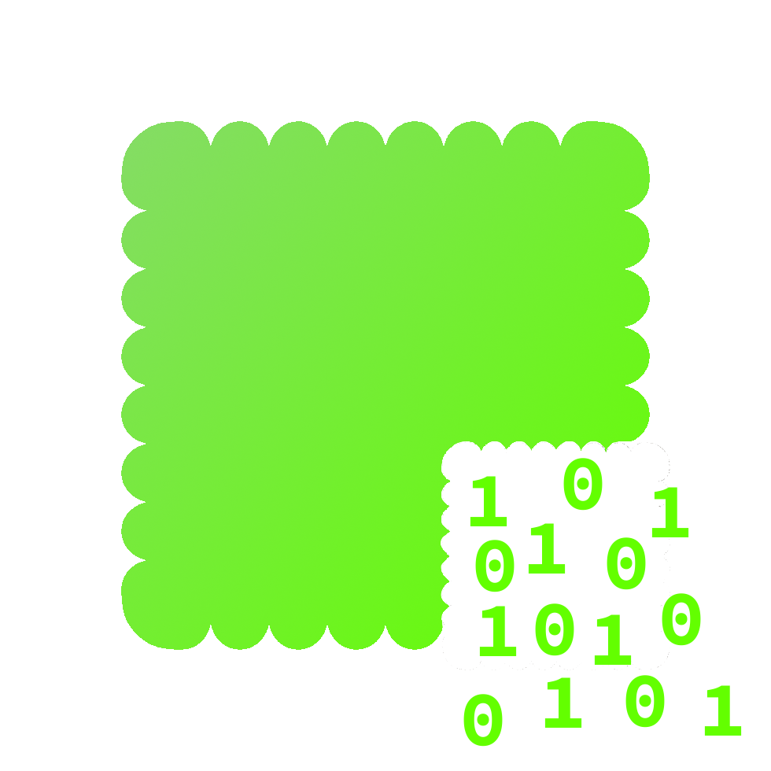

<p align="center"></p><h1 align="center"><b>Crackers</b></h1><p align="center">For all your munching and cracking needs ;)</p><div align="center"><a></a> <a href="https://www.github.linkrbot.com/rinux/rinuxcore"><a href="https://www.github.com/AtomicGamer9523"></a></div>


### Examples

```bash
# Crack a sha256 hash that starts with 0xdeadbeef
crackers.exe startswith 0xdeadbeef

# Crack a sha1 hash that ends with 000 using 4 threads
crackers.exe -j 4 -t sha1 endswith 000

# Crack an md5 hash that starts with 1234 and only contains ascii characters
crackers.exe -a -t md5 startswith 1234
```

### Help

also available via `crackers help`

```text
For all your munching and cracking needs ;)

Usage: crackers(exe) [OPTIONS] --transformer <TRANSFORMER_TYPE> <COMMAND>

Commands:
  startswith  Validates that the input bytes start with the given bytes
  endswith    Validates that the input bytes end with the given bytes
  help        Print this message or the help of the given subcommand(s)

Options:
  -l, --log-level <LOG_LEVEL>           The log level to use [default: info]
  -p, --pretty                          Whether to pretty print the output
  -t, --transformer <TRANSFORMER_TYPE>  The transformer to use [default: sha256]
  -j, --threads <THREADS>               The number of threads to use for cracking [default: 1]
  -n, --no-stop                         Whether to stop after the first solution was found
  -a, --only-ascii                      Whether to only allow ascii characters as the solution
  -h, --help                            Print help
```
